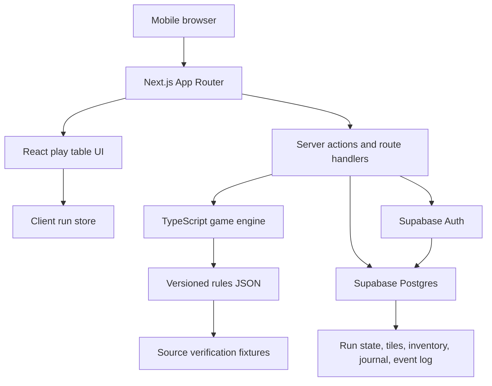

# PRD - Miru Digital

## 1. Overview

### Product Summary
Miru Digital helps new solo RPG players explore Miru without rulebook friction. It is a mobile-first web app that presents Miru as a focused guided play table: map, character state, dice, prompt, inventory, saves, and journal context in one place.

The app should handle procedure and bookkeeping while preserving the player's authorship. It resolves the rules needed for the current moment, applies state changes, autosaves the run, and leaves interpretation and journaling to the player.

### Objective
This PRD covers the private alpha and v1 foundation for Miru Digital. The first build must deliver the magic moment: a player taps Next Day and the app routes the current game state through the correct Miru flow with readable prompts, dice, state changes, camping, and journaling.

The MVP is not the public launch. Public distribution depends on rights and licensing. The product should be built so the 90-day target can become a rules-complete polished private alpha, but the first milestone should prove the guided play loop and source-verified rules architecture.

### Market Differentiation
The technical implementation must make Miru Digital feel purpose-built for one game and one player. Generic VTTs and dice rollers can display pieces of a session, but they do not know Miru's daily turn routing, tile state, event repeatability, survival penalties, enemy persistence, reward rules, or journal cadence. The app's differentiation depends on encoding those procedures as a reliable game engine, not scattering them across UI components.

### Magic Moment
The magic moment is: the player taps Next Day, and the app quietly stitches together terrain, tile state, event logic, survival needs, and legal choices into one clean flow. To enable this technically, run state must load quickly, the game engine must be deterministic and testable, dice rolls must be recorded, state transitions must be auditable, and the UI must reveal only the current step plus any needed context.

### Success Criteria
- New anonymous player can create a run and reach the play table in under 60 seconds.
- First complete Next Day flow can be completed in under 3 minutes by a new tester without opening the PDF.
- Autosave succeeds for 99% of state transitions during private alpha testing.
- All P0 game engine rules have unit tests or fixture tests.
- Mobile LCP is under 2.5 seconds on a mid-range phone over simulated 4G.
- Every Supabase table in the public schema has RLS enabled before private tester data is stored.

## 2. Technical Architecture

### Architecture Overview


### Chosen Stack
| Layer | Choice | Rationale |
| --- | --- | --- |
| Frontend | Next.js + React + TypeScript | Best fit for a mobile-first web app with strong routing, deployability, TypeScript support, and room to grow into a PWA-style experience while still letting the core play table feel like an app. |
| Backend | Supabase | Chosen to make the product cloud-ready from the start, with managed backend services that can support saved runs, rules content metadata, anonymous users, and future account upgrades. |
| Database | Supabase Postgres | Matches the backend choice and provides a durable relational store for runs, map tiles, inventory, journal entries, event history, and other structured game state. |
| Auth | Supabase Anonymous Auth | Players can start immediately as guests while each saved run still has an authenticated owner for Supabase row-level security. Email upgrade can be added later for account recovery and cross-device continuity. |
| Payments | None | Skipped because the revenue model is free for now. Payment infrastructure can be added later if monetization becomes part of the product. |

### Stack Integration Guide
Set up the app in this order:

1. Scaffold Next.js with TypeScript, App Router, Tailwind CSS, ESLint, and `src/` directory.
2. Add Supabase packages: `@supabase/supabase-js` and `@supabase/ssr`.
3. Create Supabase project, enable Anonymous Sign-Ins, and configure local environment variables.
4. Add database migrations under `supabase/migrations/` and enable RLS on every public table.
5. Build server/client Supabase helpers under `src/lib/supabase/`.
6. Build pure game engine modules under `src/lib/game/` before wiring UI.
7. Add versioned rules data under `src/data/miru1v2e/`.
8. Build the play table UI against typed engine state and API responses.

Required environment variables:

```bash
NEXT_PUBLIC_SUPABASE_URL=
NEXT_PUBLIC_SUPABASE_ANON_KEY=
SUPABASE_SERVICE_ROLE_KEY=
NEXT_PUBLIC_APP_URL=http://localhost:3000
```

The service role key must only be used in server-only code and never exposed to the browser. Browser code uses the publishable anon key and authenticated user JWT. Use dynamic rendering for routes that depend on anonymous user metadata so Next.js does not cache user-specific auth state.

Common gotchas:
- Supabase anonymous users use the `authenticated` Postgres role, not the unauthenticated `anon` role.
- RLS policies must use `auth.uid()` for ownership and may inspect the JWT `is_anonymous` claim when behavior differs between guest and permanent users.
- Rules engine code should be pure TypeScript and not import Supabase or React.
- Route handlers should validate all inputs with `zod` before applying game actions.
- Source-derived rules data should be versioned and covered by validation tests before being used by the engine.

### Repository Structure
```text
project-root/
  docs/
    product-vision.md
    prd.md
    product-roadmap.md
    gtm.md
    miru-rules-requirements.md
  public/
    assets/
      source/
        README.md
  src/
    app/
      layout.tsx
      page.tsx
      play/[runId]/page.tsx
      rules/page.tsx
      runs/page.tsx
      settings/page.tsx
      api/
        runs/route.ts
        runs/[runId]/route.ts
        runs/[runId]/actions/route.ts
        runs/[runId]/journal/route.ts
        rules/search/route.ts
    components/
      ui/
        Button.tsx
        IconButton.tsx
        Panel.tsx
        Modal.tsx
        StatBadge.tsx
        DiceResult.tsx
      features/
        auth/AnonymousSessionGate.tsx
        map/HexMap.tsx
        map/TileInspector.tsx
        play/PlayTable.tsx
        play/CurrentPrompt.tsx
        play/ActionBar.tsx
        character/CharacterPanel.tsx
        inventory/InventoryPanel.tsx
        journal/JournalPrompt.tsx
        rules/RuleReferenceDrawer.tsx
    data/
      miru1v2e/
        manifest.ts
        terrain.ts
        items.ts
        enemies.ts
        events.ts
        calendar.ts
        villages.ts
        challengeModes.ts
    lib/
      game/
        actions.ts
        combat.ts
        dice.ts
        engine.ts
        inventory.ts
        map.ts
        rewards.ts
        rules.ts
        survival.ts
        turnMachine.ts
        types.ts
      supabase/
        browser.ts
        server.ts
        middleware.ts
      validation/
        schemas.ts
      utils/
        cn.ts
    styles/
      globals.css
  supabase/
    migrations/
      0001_initial_schema.sql
      0002_rls_policies.sql
  tests/
    fixtures/
      miru1v2e/
    unit/
      game/
    integration/
      api/
    e2e/
      first-run.spec.ts
  .env.example
  package.json
  tailwind.config.ts
  vitest.config.ts
  playwright.config.ts
```

### Infrastructure & Deployment
Deploy the Next.js app to Vercel for the path of least resistance. Use Supabase hosted Postgres/Auth for private alpha. Use Vercel preview deployments for PR review. Use Supabase CLI locally for migrations and seeded test data.

Recommended environments:
- `local`: local Next.js dev server and Supabase local or hosted dev project.
- `preview`: Vercel preview branch with Supabase staging project.
- `production`: Vercel production with Supabase production project, created only when rights and launch path are clear.

### Security Considerations
Enable RLS on all public tables. Every user-owned table must include `user_id uuid not null references auth.users(id) on delete cascade` and policies that restrict select, insert, update, and delete to `auth.uid() = user_id`.

Validate all API inputs with `zod`. Do not trust client-submitted state transitions; the server should load current run state, apply one declared action through the game engine, and persist the resulting state and event log atomically where possible.

Do not store copyrighted source PDFs in public app routes. Source assets used in private development must be documented and isolated. Before public launch, confirm which source assets and text can be distributed.

Enable bot prevention for anonymous sign-ins before any public release. Add cleanup jobs or admin scripts for abandoned anonymous users if testing creates user churn.

### Cost Estimate
For the first 6 months at fewer than 1000 testers, expected cost should be close to free:
- Vercel: free or low paid tier depending on usage and collaboration needs.
- Supabase: free tier may cover early private alpha; upgrade if database size, auth MAU, backups, or project limits require it.
- Domain: about $10-25/year if a public domain is purchased.
- Monitoring: start with free Vercel analytics/logs and Supabase logs; add paid monitoring only after public launch.

## 3. Data Model

### Entity Definitions
Use Supabase Auth `auth.users` as the canonical user table. Application tables live in `public`.

```sql
create type run_status as enum ('active', 'won', 'dead_continuable', 'ended');
create type terrain_type as enum ('unknown', 'forest', 'mountains', 'grasslands', 'desert', 'swamp', 'impassable');
create type icon_type as enum ('village', 'enemy', 'quest', 'treasure', 'impassable');
create type action_type as enum ('start_run', 'next_day', 'move', 'roll', 'resolve_event', 'combat_action', 'camp', 'journal', 'end_run');

create table profiles (
  id uuid primary key references auth.users(id) on delete cascade,
  display_name varchar(80),
  is_anonymous boolean not null default true,
  created_at timestamptz not null default now(),
  updated_at timestamptz not null default now()
);

create table runs (
  id uuid primary key default gen_random_uuid(),
  user_id uuid not null references auth.users(id) on delete cascade,
  title varchar(120) not null default 'Miru Run',
  rules_version varchar(40) not null default 'miru1v2e',
  status run_status not null default 'active',
  current_day integer not null default 1 check (current_day >= 1),
  current_tile_id uuid,
  hp integer not null default 10 check (hp >= 0 and hp <= 20),
  ep integer not null default 10 check (ep >= 0 and ep <= 20),
  base_atk integer not null default 1,
  base_def integer not null default 1,
  bitliths integer not null default 0 check (bitliths >= 0),
  starvation_count integer not null default 0 check (starvation_count >= 0),
  sleep_deprivation_count integer not null default 0 check (sleep_deprivation_count >= 0),
  minor_injury_count integer not null default 0 check (minor_injury_count >= 0),
  active_enemy jsonb,
  active_effects jsonb not null default '[]'::jsonb,
  pending_prompt jsonb,
  last_journal_entry text,
  created_at timestamptz not null default now(),
  updated_at timestamptz not null default now()
);

create table run_tiles (
  id uuid primary key default gen_random_uuid(),
  run_id uuid not null references runs(id) on delete cascade,
  user_id uuid not null references auth.users(id) on delete cascade,
  row_number integer not null check (row_number between 1 and 12),
  column_letter char(1) not null check (column_letter between 'A' and 'I'),
  terrain terrain_type not null default 'unknown',
  visited boolean not null default false,
  icons icon_type[] not null default '{}',
  event_history jsonb not null default '[]'::jsonb,
  repeatability_state jsonb not null default '{}'::jsonb,
  enemy_state jsonb,
  notes text,
  created_at timestamptz not null default now(),
  updated_at timestamptz not null default now(),
  unique (run_id, row_number, column_letter)
);

alter table runs
  add constraint runs_current_tile_fk
  foreign key (current_tile_id) references run_tiles(id);

create table run_inventory (
  id uuid primary key default gen_random_uuid(),
  run_id uuid not null references runs(id) on delete cascade,
  user_id uuid not null references auth.users(id) on delete cascade,
  item_key varchar(120) not null,
  item_name varchar(160) not null,
  category varchar(80) not null,
  quantity integer not null default 1 check (quantity >= 0),
  metadata jsonb not null default '{}'::jsonb,
  created_at timestamptz not null default now(),
  updated_at timestamptz not null default now(),
  unique (run_id, item_key)
);

create table tech_skills (
  id uuid primary key default gen_random_uuid(),
  run_id uuid not null references runs(id) on delete cascade,
  user_id uuid not null references auth.users(id) on delete cascade,
  skill_key varchar(120) not null,
  skill_name varchar(160) not null,
  unlocked boolean not null default false,
  training_level integer not null default 0 check (training_level between 0 and 6),
  created_at timestamptz not null default now(),
  updated_at timestamptz not null default now(),
  unique (run_id, skill_key)
);

create table journal_entries (
  id uuid primary key default gen_random_uuid(),
  run_id uuid not null references runs(id) on delete cascade,
  user_id uuid not null references auth.users(id) on delete cascade,
  day_number integer not null check (day_number >= 1),
  tile_id uuid references run_tiles(id) on delete set null,
  body text not null check (char_length(body) <= 1000),
  created_at timestamptz not null default now(),
  updated_at timestamptz not null default now()
);

create table action_log (
  id uuid primary key default gen_random_uuid(),
  run_id uuid not null references runs(id) on delete cascade,
  user_id uuid not null references auth.users(id) on delete cascade,
  action_type action_type not null,
  day_number integer not null,
  tile_id uuid references run_tiles(id) on delete set null,
  input jsonb not null default '{}'::jsonb,
  result jsonb not null default '{}'::jsonb,
  dice_rolls jsonb not null default '[]'::jsonb,
  created_at timestamptz not null default now()
);

create table content_versions (
  id uuid primary key default gen_random_uuid(),
  key varchar(80) not null unique,
  source_name varchar(160) not null,
  status varchar(40) not null default 'draft',
  verified_at timestamptz,
  notes text,
  created_at timestamptz not null default now()
);
```

### Relationships
- One auth user has one profile.
- One auth user has many runs.
- One run has many run tiles, inventory rows, tech skills, journal entries, and action log rows.
- One run has one current tile, nullable only during initial run creation.
- Each user-owned child table duplicates `user_id` for simple RLS ownership checks.
- Deleting an auth user cascades profile and runs. Deleting a run cascades game state.
- Journal entries retain text even if tile reference is removed; `tile_id` uses `on delete set null`.

### Indexes
```sql
create index runs_user_status_idx on runs (user_id, status, updated_at desc);
create index run_tiles_run_coordinate_idx on run_tiles (run_id, row_number, column_letter);
create index run_inventory_run_category_idx on run_inventory (run_id, category);
create index journal_entries_run_day_idx on journal_entries (run_id, day_number);
create index action_log_run_created_idx on action_log (run_id, created_at);
create index action_log_run_day_idx on action_log (run_id, day_number);
```

RLS policies:

```sql
alter table profiles enable row level security;
alter table runs enable row level security;
alter table run_tiles enable row level security;
alter table run_inventory enable row level security;
alter table tech_skills enable row level security;
alter table journal_entries enable row level security;
alter table action_log enable row level security;
alter table content_versions enable row level security;

create policy "Users manage own profile" on profiles
  for all to authenticated
  using ((select auth.uid()) = id)
  with check ((select auth.uid()) = id);

create policy "Users manage own runs" on runs
  for all to authenticated
  using ((select auth.uid()) = user_id)
  with check ((select auth.uid()) = user_id);

create policy "Users manage own run tiles" on run_tiles
  for all to authenticated
  using ((select auth.uid()) = user_id)
  with check ((select auth.uid()) = user_id);

create policy "Users manage own inventory" on run_inventory
  for all to authenticated
  using ((select auth.uid()) = user_id)
  with check ((select auth.uid()) = user_id);

create policy "Users manage own tech skills" on tech_skills
  for all to authenticated
  using ((select auth.uid()) = user_id)
  with check ((select auth.uid()) = user_id);

create policy "Users manage own journals" on journal_entries
  for all to authenticated
  using ((select auth.uid()) = user_id)
  with check ((select auth.uid()) = user_id);

create policy "Users read own action log" on action_log
  for select to authenticated
  using ((select auth.uid()) = user_id);

create policy "Server writes action log" on action_log
  for insert to authenticated
  with check ((select auth.uid()) = user_id);
```

`content_versions` should be readable only to authenticated private-alpha users until public rights are clear. In early development, it can be server-only.

## 4. API Specification

### API Design Philosophy
Use Next.js route handlers as the server boundary for state-changing game actions. Client components may read simple run state through server-rendered data or API calls, but they must not compute authoritative state transitions. The server loads current state from Supabase, validates the requested action with `zod`, applies the pure TypeScript game engine, writes updated state, and records an action log entry.

All responses use this shape:

```typescript
type ApiSuccess<T> = { ok: true; data: T };
type ApiError = {
  ok: false;
  error: {
    code: string;
    message: string;
    details?: unknown;
  };
};
```

### Endpoints
```text
POST /api/runs
Auth: Required, anonymous allowed
Body: { title?: string; startingColumn?: "A"|"B"|"C"|"D"|"E"|"F"|"G"|"H"|"I" }
Response 201: { ok: true, data: { runId: string, currentTileId: string } }
Response 400: { ok: false, error: { code: "INVALID_START", message: string } }
Response 401: { ok: false, error: { code: "UNAUTHORIZED", message: string } }
```

Creates a run with HP 10, EP 10, 3 Meal Bars, day 1, base ATK 1, base DEF 1, and starting tile in row 01.

```text
GET /api/runs
Auth: Required
Response 200: { ok: true, data: { runs: RunSummary[] } }
```

Returns recent runs for the current user ordered by `updated_at desc`.

```text
GET /api/runs/:runId
Auth: Required, owner only
Response 200: { ok: true, data: RunSnapshot }
Response 404: { ok: false, error: { code: "RUN_NOT_FOUND", message: string } }
```

Returns run, current tile, visible map state, inventory, tech skills, active prompt, last journal entry, and recent action log.

```text
PATCH /api/runs/:runId
Auth: Required, owner only
Body: { title?: string; status?: "active"|"ended" }
Response 200: { ok: true, data: RunSummary }
```

Updates non-engine metadata. Game state changes must go through action endpoints.

```text
POST /api/runs/:runId/actions
Auth: Required, owner only
Body: {
  type: "next_day" | "move" | "resolve_prompt" | "combat_action" | "camp";
  payload?: unknown;
}
Response 200: { ok: true, data: { run: RunSnapshot, action: ActionLogEntry } }
Response 409: { ok: false, error: { code: "INVALID_ACTION_FOR_STATE", message: string } }
```

The main engine endpoint. It validates the action against current run state and returns the updated snapshot plus a concise action summary for UI display.

```text
POST /api/runs/:runId/journal
Auth: Required, owner only
Body: { dayNumber: number; body: string; tileId?: string }
Response 201: { ok: true, data: JournalEntry }
Response 400: { ok: false, error: { code: "INVALID_JOURNAL_ENTRY", message: string } }
```

Creates or updates the journal entry for the current day. Limit body to 1000 characters.

```text
GET /api/rules/search?q=:query
Auth: Required
Response 200: { ok: true, data: { results: RuleSearchResult[] } }
```

Searches local/versioned rules metadata exposed by the server. Do not expose large source text until rights are clear.

```text
GET /api/rules/context?key=:ruleKey
Auth: Required
Response 200: { ok: true, data: RuleContext }
```

Returns concise in-app help for a specific rule key, including source verification status and internal reference path.

## 5. User Stories

### Epic: First Run
**US-001: Start immediately as a guest**
As Sam, I want to start playing without creating an account so that curiosity turns into play before friction wins.

Acceptance Criteria:
- [ ] Given I am a new visitor, when I tap Start Run, then the app creates a Supabase anonymous session.
- [ ] Given anonymous session creation succeeds, when the run is created, then I land on the play table.
- [ ] Edge case: anonymous auth fails -> show a clear retry message and do not create partial run state.

**US-002: Initialize a faithful run**
As Sam, I want the app to set up the starting state so that I do not need to read setup rules first.

Acceptance Criteria:
- [ ] Given I create a run, then HP is 10, EP is 10, Meal Bars quantity is 3, day is 1, ATK is 1, DEF is 1.
- [ ] Given I choose or accept a starting column, then the starting tile is in row 01.
- [ ] Edge case: invalid starting column -> reject with validation error.

### Epic: Guided Play
**US-003: See the current game state**
As Sam, I want map, character state, inventory highlights, and current prompt visible together so that I understand where I am.

Acceptance Criteria:
- [ ] Given a run exists, when I open it, then current day, tile, HP, EP, food, inventory highlights, and current prompt render.
- [ ] Given a run has journal history, then the latest entry is visible or one tap away.

**US-004: Resolve the Next Day flow**
As Sam, I want the app to guide the next day so that I know which rule applies and what choices are legal.

Acceptance Criteria:
- [ ] Given I tap Next Day, then the server applies the correct state transition for the current tile state.
- [ ] Given dice are rolled, then results are shown and recorded in the action log.
- [ ] Given the day ends, then the app prompts for camp/survival and a short journal entry.

**US-005: Resume without reconstructing context**
As Sam, I want to return to a saved run and instantly know what to do next so that short sessions are viable.

Acceptance Criteria:
- [ ] Given I leave and return, when the run loads, then the latest persisted state is restored.
- [ ] Given the run has a pending prompt, then the app resumes that prompt rather than advancing time.

### Epic: Rules Fidelity
**US-006: Trust the rules engine**
As a solo RPG hobbyist, I want rules to match the source game so that the app feels faithful rather than approximate.

Acceptance Criteria:
- [ ] Given a P0 rule from `docs/miru-rules-requirements.md`, then there is a corresponding engine test or fixture.
- [ ] Given a source rule is ambiguous, then it is marked as an open issue and not silently resolved in production logic.

### Epic: Journal and History
**US-007: Keep a short daily journal**
As Sam, I want to write one or two sentences after a day so that my run becomes my story.

Acceptance Criteria:
- [ ] Given a day is resolved, then the app prompts for an optional or required journal entry according to settings.
- [ ] Given I save a journal entry, then it is tied to run, day, and tile.

## 6. Functional Requirements

**FR-001: Anonymous Session Gate**
Priority: P0
Description: The app must create or restore a Supabase anonymous session before any user-owned run data is accessed.
Acceptance Criteria:
- Anonymous session is created on first Start Run.
- Existing session is reused on refresh.
- Auth failure shows retry UI.
Related Stories: US-001

**FR-002: Run Initialization**
Priority: P0
Description: Create a new Miru 1 v2e run with source-accurate starting state.
Acceptance Criteria:
- Initializes HP 10, EP 10, 3 Meal Bars, day 1, ATK 1, DEF 1.
- Creates starting tile in row 01.
- Records `start_run` action log.
Related Stories: US-002

**FR-003: Mobile Play Table**
Priority: P0
Description: Provide the main play surface with map, character state, current prompt, dice/results, inventory highlights, and journal affordance.
Acceptance Criteria:
- Works at 375px viewport width.
- No overlapping text or controls.
- Current action remains discoverable without scrolling through the entire page.
Related Stories: US-003

**FR-004: Hex Map State**
Priority: P0
Description: Model rows 01-12 and columns A-I with terrain, visit status, icons, event history, enemy state, and notes.
Acceptance Criteria:
- Coordinates are stable and unique per run.
- Movement validates six directions: W, NW, NE, E, SE, SW.
- Impassable tiles prevent ordinary traversal.
Related Stories: US-003, US-004

**FR-005: Dice Utility and Audit Trail**
Priority: P0
Description: Support 1D6, 2D6, and bundled 4D6 rolls with recorded purpose, result, and action association.
Acceptance Criteria:
- Dice result is visible in UI.
- Roll metadata is persisted in `action_log.dice_rolls`.
- Tests can inject deterministic rolls.
Related Stories: US-004, US-006

**FR-006: Daily Turn State Machine**
Priority: P0
Description: Route each day according to tile state, terrain state, icon state, old/new tile rules, clarity, event, and camp requirements.
Acceptance Criteria:
- New blank tile routes through terrain roll.
- Old blank tile routes through optional weather and clarity.
- Icon tiles route to icon-specific event flow.
- Day cannot advance while required survival/camp prompt is unresolved.
Related Stories: US-004, US-006

**FR-007: Survival and Camping Resolver**
Priority: P0
Description: Apply food, sleep, starvation, sleep deprivation, healing caps, and minor injury effects according to source requirements.
Acceptance Criteria:
- Meal Bar, Fruit, Tavern Meal, and Old Wine Bottle effects are represented.
- HP and EP do not heal above 20.
- Starvation and sleep deprivation death thresholds are enforced.
Related Stories: US-004, US-006

**FR-008: Representative Event and Combat Slice**
Priority: P0
Description: Implement enough event and combat logic to prove the full Next Day magic moment through event resolution, enemy turn, player action, reward, camp, and journal.
Acceptance Criteria:
- At least one terrain event and one enemy combat path are playable.
- Combat records enemy HP, player HP/EP, attacks, escape attempts, and rewards.
- Negative damage behavior remains flagged until source verification resolves it.
Related Stories: US-004, US-006

**FR-009: Journal Entries**
Priority: P0
Description: Let players add or edit short day-specific journal entries.
Acceptance Criteria:
- Journal entry is tied to run, day, and tile.
- Entry limit is 1000 characters.
- Latest entry appears in resume context.
Related Stories: US-005, US-007

**FR-010: Autosave and Resume**
Priority: P0
Description: Persist run state after every successful action and restore the latest pending state on return.
Acceptance Criteria:
- Refreshing during a pending prompt restores that prompt.
- Failed save shows error and does not advance UI optimistically.
- Run list shows most recently updated runs first.
Related Stories: US-005

**FR-011: Rules Content Data Architecture**
Priority: P0
Description: Store source-derived rules tables in typed versioned data files and validate them with tests.
Acceptance Criteria:
- Each rules file exports typed data and source verification metadata.
- Open source issues are tracked and test-visible.
- Engine imports data from `src/data/miru1v2e`, not components.
Related Stories: US-006

**FR-012: Full Standard Rules Coverage**
Priority: P1
Description: Complete standard Miru 1 v2e coverage for terrain events, encounters, ruins, rewards, villages, shops, quests, story days, special locations, items, death, and ending.
Acceptance Criteria:
- Every non-challenge-mode section in `docs/miru-rules-requirements.md` maps to implementation or verified deferral.
- Full run can be completed or lost according to source rules.
- Source verification checklist has no unresolved P0 ambiguity.
Related Stories: US-006

**FR-013: Rules Lookup Drawer**
Priority: P1
Description: Show concise contextual rule help for the current prompt.
Acceptance Criteria:
- Current prompt can open rule context in one tap.
- Rule context is short, source-referenced, and mobile readable.
- Search returns rule metadata, not full source PDFs.
Related Stories: US-004, US-006

**FR-014: Run History**
Priority: P1
Description: Provide a list of active and ended runs with status, latest day, and updated timestamp.
Acceptance Criteria:
- User can resume an active run.
- User can rename or end a run.
- Ended runs remain readable.
Related Stories: US-005

**FR-015: Challenge Mode Support**
Priority: P2
Description: Add weather, terrain odds variant, and rusty weapons variant after standard rules are stable.
Acceptance Criteria:
- Challenge modes are opt-in at run creation.
- Challenge state is saved on the run.
- Standard runs remain unaffected.
Related Stories: US-006

## 7. Non-Functional Requirements

### Performance
- LCP under 2.5 seconds on mobile simulated 4G for the home and play pages.
- Time to Interactive under 3.5 seconds for the play table.
- API p95 response under 400ms for run fetch and under 800ms for state-changing actions at private alpha scale.
- Initial JavaScript bundle should stay under 250KB gzip before P1 features.

### Security
- RLS enabled on every public Supabase table.
- All user-owned rows restricted by `auth.uid() = user_id`.
- Service role key used only in server-only modules.
- Inputs validated with `zod` on every route handler.
- Anonymous sign-in abuse protection enabled before public launch.

### Accessibility
- Meet WCAG 2.1 AA for core flows.
- Minimum touch target 44x44px.
- Keyboard access for all action buttons, modals, drawers, and map tile inspection.
- Screen reader labels for day, tile, HP, EP, dice result, current prompt, and action outcomes.

### Scalability
- Support 1000 private alpha users and 10,000 saved runs without schema changes.
- Run fetch queries must use `runs_user_status_idx`.
- Action log may grow large; UI should paginate or fetch recent actions only.

### Reliability
- Autosave after every successful engine action.
- Never advance UI state permanently until server persistence succeeds.
- Graceful offline or network-failure state: show current loaded snapshot as read-only and offer retry.
- Target 99.5% app availability during private alpha.

## 8. UI/UX Requirements

### Screen: Home / Start
Route: `/`
Purpose: Start a new run or continue the latest run.
Layout: Mobile-first landing surface with product title, one-line explanation, primary Start Run action, and Continue Run if a saved run exists.

States:
- **Empty:** Show Start Run only.
- **Loading:** Show quiet "Preparing your table" status.
- **Populated:** Show Continue latest run and secondary All Runs link.
- **Error:** Show auth or load error with Try Again.

Key Interactions:
- Tap Start Run -> create anonymous session if needed -> create run -> navigate to `/play/[runId]`.
- Tap Continue -> load latest active run.

Components Used: Button, Panel, AnonymousSessionGate.

### Screen: Play Table
Route: `/play/[runId]`
Purpose: Resolve the current Miru run.
Layout: Mobile stack: current prompt/action area, compact stat row, map viewport, inventory/journal controls, recent outcome. Desktop can split map and state into two columns.

States:
- **Empty:** If run not found, show owner-safe not found state.
- **Loading:** Skeleton panels for prompt, stats, and map.
- **Populated:** Render run snapshot and current legal actions.
- **Error:** Show retry for fetch/action failure without losing current snapshot.

Key Interactions:
- Tap Next Day -> POST action -> show dice/result/prompt sequence.
- Tap map tile -> inspect terrain, icons, notes, and movement legality.
- Tap Camp or Resolve Prompt -> apply engine transition.
- Tap Journal -> open daily journal prompt.

Components Used: PlayTable, CurrentPrompt, ActionBar, HexMap, TileInspector, CharacterPanel, InventoryPanel, DiceResult, JournalPrompt, RuleReferenceDrawer.

### Screen: Runs
Route: `/runs`
Purpose: Browse and resume saved runs.
Layout: List of run cards with title, status, current day, latest journal excerpt, updated date, and resume action.

States:
- **Empty:** "No runs yet. Start a new run."
- **Loading:** List skeletons.
- **Populated:** Active runs first, ended runs below.
- **Error:** Retry load.

Key Interactions:
- Tap run -> navigate to play table.
- Rename run -> inline edit with save.
- End run -> confirmation modal.

Components Used: Panel, Button, Modal, StatBadge.

### Screen: Rules
Route: `/rules`
Purpose: Search concise rule help and verification status.
Layout: Search input, results list, rule detail panel. This is secondary; contextual drawer is more important in play.

States:
- **Empty:** Show common rule categories.
- **Loading:** Search pending indicator.
- **Populated:** Result list with source status.
- **Error:** Search failure message.

Key Interactions:
- Type query -> fetch metadata results.
- Tap result -> open detail.

Components Used: Input, Panel, RuleReferenceDrawer.

### Screen: Settings
Route: `/settings`
Purpose: Show guest status, optional email upgrade placeholder, accessibility preferences, and export options.
Layout: Simple settings list with account, display, data, and about sections.

States:
- **Empty:** Not applicable.
- **Loading:** Session loading.
- **Populated:** Guest session details and preferences.
- **Error:** Retry session load.

Key Interactions:
- Tap Upgrade Account -> placeholder until P1.
- Toggle reduced motion or compact prompts -> save local preference.

Components Used: Panel, Button, Input, Modal.

## 9. Design System

### Color Tokens
```css
:root {
  --color-background: #F3E8D0;
  --color-surface: #FFF8E8;
  --color-surface-muted: #E7D7B8;
  --color-text: #251F18;
  --color-text-muted: #6F604B;
  --color-border: #B9A787;
  --color-primary: #2F5F4A;
  --color-primary-hover: #244A3A;
  --color-secondary: #8B5E34;
  --color-accent: #C47A3A;
  --color-success: #3F6F4E;
  --color-warning: #B7791F;
  --color-error: #9F3A38;
  --color-info: #3A5F7A;
}
```

### Typography Tokens
```css
@import url('https://fonts.googleapis.com/css2?family=Fraunces:wght@600;700&family=IBM+Plex+Mono:wght@400;600&family=Inter:wght@400;500;600&display=swap');

:root {
  --font-heading: 'Fraunces', serif;
  --font-body: 'Inter', sans-serif;
  --font-mono: 'IBM Plex Mono', monospace;
  --text-xs: 0.75rem;
  --text-sm: 0.875rem;
  --text-base: 1rem;
  --text-lg: 1.125rem;
  --text-xl: 1.25rem;
  --text-2xl: 1.5rem;
  --text-3xl: 1.875rem;
}
```

### Spacing Tokens
Use `4px` base: `1: 4px`, `2: 8px`, `3: 12px`, `4: 16px`, `5: 20px`, `6: 24px`, `8: 32px`, `10: 40px`, `12: 48px`, `16: 64px`, `24: 96px`.

### Component Specifications
- **Button:** 44px minimum height, radius 6px, primary green fill, secondary parchment surface with ink border, icon gap 8px.
- **IconButton:** 44x44px fixed size, visible label through tooltip or `aria-label`, no text if a familiar icon exists.
- **Panel:** surface background, 1px border, radius 6px, no nested panels.
- **Modal/Drawer:** radius 8px, surface background, focus trapped, Escape closes when safe.
- **StatBadge:** mono label, strong numeric value, semantic color only with text label.
- **DiceResult:** mono die notation, accent result value, action log link or detail affordance.

### Tailwind Configuration
```typescript
theme: {
  extend: {
    colors: {
      field: {
        background: 'var(--color-background)',
        surface: 'var(--color-surface)',
        surfaceMuted: 'var(--color-surface-muted)',
      },
      ink: {
        text: 'var(--color-text)',
        muted: 'var(--color-text-muted)',
        border: 'var(--color-border)',
      },
      signal: {
        primary: 'var(--color-primary)',
        primaryHover: 'var(--color-primary-hover)',
        secondary: 'var(--color-secondary)',
        accent: 'var(--color-accent)',
      },
      status: {
        success: 'var(--color-success)',
        warning: 'var(--color-warning)',
        error: 'var(--color-error)',
        info: 'var(--color-info)',
      },
    },
    fontFamily: {
      heading: ['var(--font-heading)'],
      body: ['var(--font-body)'],
      mono: ['var(--font-mono)'],
    },
    spacing: {
      1: '4px',
      2: '8px',
      3: '12px',
      4: '16px',
      5: '20px',
      6: '24px',
      8: '32px',
      10: '40px',
      12: '48px',
      16: '64px',
      24: '96px',
    },
    borderRadius: {
      sm: '4px',
      md: '6px',
      lg: '8px',
    },
    boxShadow: {
      soft: '0 8px 24px rgb(37 31 24 / 0.08)',
    },
  },
}
```

## 10. Auth Implementation

### Auth Flow
1. On app load, create a Supabase browser client.
2. Check for existing session.
3. If no session exists and the user taps Start Run, call `supabase.auth.signInAnonymously()`.
4. Create or upsert `profiles` row with `is_anonymous = true`.
5. Create run owned by `auth.uid()`.
6. Later P1 upgrade can link email or OAuth identity to the anonymous user.

### Provider Configuration
Enable Anonymous Sign-Ins in Supabase Auth settings. Configure redirect URLs for local, preview, and production. Before public launch, configure invisible CAPTCHA or Cloudflare Turnstile to reduce anonymous account abuse.

### Protected Routes
`/play/[runId]`, `/runs`, `/rules`, and `/settings` require a Supabase session. If no session exists, route the user to `/` with a friendly start prompt. API routes return 401 if no user is available.

### User Session Management
Use `@supabase/ssr` helpers for server and browser clients. Keep auth-dependent routes dynamic. The app should not show sign-in UI during first-run unless anonymous auth fails.

### Role-Based Access
No admin roles are required for MVP. All normal users, anonymous or permanent, can manage their own runs. Internal content verification tools, if added, should require a separate admin flag and should not be exposed in the private alpha UI.

## 11. Payment Integration

No payment integration is included. Revenue model is free for now, and payments are out of scope until rights, launch path, and monetization intent are clear.

## 12. Edge Cases & Error Handling

### Feature: Anonymous Auth
| Scenario | Expected Behavior | Priority |
| --- | --- | --- |
| Anonymous sign-in fails | Show retry and explain that saves need a session | P0 |
| User clears browser data | Existing anonymous account may be unrecoverable; show start-new-run path | P1 |
| Anonymous abuse before public launch | Enable CAPTCHA and cleanup abandoned anonymous users | P1 |

### Feature: Run Actions
| Scenario | Expected Behavior | Priority |
| --- | --- | --- |
| Client sends invalid action | Return 409 with current valid actions | P0 |
| Save fails after engine transition | Do not advance UI; show retry | P0 |
| Duplicate tap on action button | Disable while pending and ignore duplicate request | P0 |
| Action log write fails | Treat transition as failed unless state and log can be reconciled | P1 |

### Feature: Rules Engine
| Scenario | Expected Behavior | Priority |
| --- | --- | --- |
| Source rule is ambiguous | Mark fixture pending and block rules-complete claim | P0 |
| Damage would be negative | Apply chosen verified behavior only after source decision; until then keep test pending | P0 |
| Event repeats incorrectly | Use tile event history and repeatability state to prevent invalid repeat | P0 |

### Feature: Network and Resume
| Scenario | Expected Behavior | Priority |
| --- | --- | --- |
| Network drops mid-session | Keep loaded snapshot visible read-only and offer retry | P0 |
| Run not found | Show not-found state without revealing whether another user's run exists | P0 |
| Auth expires | Refresh session if possible; otherwise return to start with explanation | P0 |

### Feature: UI
| Scenario | Expected Behavior | Priority |
| --- | --- | --- |
| Long item name or prompt | Wrap text without layout overlap | P0 |
| Small mobile viewport | Preserve 44px touch targets and readable map controls | P0 |
| Reduced motion requested | Disable dice/map/prompt animations | P1 |

## 13. Dependencies & Integrations

### Core Dependencies
```json
{
  "next": "latest compatible",
  "react": "latest compatible",
  "react-dom": "latest compatible",
  "@supabase/supabase-js": "latest compatible",
  "@supabase/ssr": "latest compatible",
  "zod": "latest compatible",
  "react-hook-form": "latest compatible",
  "@hookform/resolvers": "latest compatible",
  "lucide-react": "latest compatible",
  "clsx": "latest compatible",
  "tailwind-merge": "latest compatible",
  "class-variance-authority": "latest compatible",
  "zustand": "latest compatible"
}
```

### Development Dependencies
```json
{
  "typescript": "latest compatible",
  "eslint": "latest compatible",
  "prettier": "latest compatible",
  "tailwindcss": "latest compatible",
  "postcss": "latest compatible",
  "vitest": "latest compatible",
  "@testing-library/react": "latest compatible",
  "@testing-library/jest-dom": "latest compatible",
  "playwright": "latest compatible",
  "@playwright/test": "latest compatible",
  "supabase": "latest compatible"
}
```

### Third-Party Services
- **Supabase:** Auth, Postgres, RLS, and optional local development. Requires project URL, anon key, and service role key for server-only maintenance operations.
- **Vercel:** Next.js hosting and preview deployments. Requires project configuration and environment variables.
- **Google Fonts:** Loads Fraunces, Inter, and IBM Plex Mono. If offline/privacy concerns arise, self-host fonts.

## 14. Out of Scope

- Public launch: excluded until rights and licensing are clarified.
- Payments: excluded while the revenue model is free.
- Native mobile apps: excluded until mobile web retention is proven.
- Heavy animation and mobile RPG spectacle: excluded because they weaken the analog solo RPG feel.
- Multiplayer, sharing, marketplace content, and generalized VTT tools: excluded because the product must remain one game, one player, one table.
- AI-generated narration: excluded because it could overwrite the player's authorship and introduce tone/content risk.

## 15. Open Questions

**Digital adaptation rights:** Can Miru branding, rules text, source assets, and digital distribution be used publicly? Recommended default: private prototype only until permission is clear.

**Rules ambiguity resolution:** How should negative combat damage be handled, and how should repeated Ruins/Encounters replacement rules work? Recommended default: keep open tests pending and visually verify against source before implementation.

**Rules content storage:** Should full event content live in static TypeScript/JSON files or Postgres tables? Recommended default: typed static data for source-controlled QA, with Postgres only for user/run state.

**Offline behavior:** Should the app support offline play? Recommended default: not in MVP beyond graceful read-only failure states; revisit after core flow is stable.

**Email upgrade:** When should anonymous users be able to attach email? Recommended default: P1 after first-run flow and save reliability are proven.

**Challenge mode timing:** Should challenge modes ship in the 90-day private alpha? Recommended default: only after full standard rules coverage is stable.
